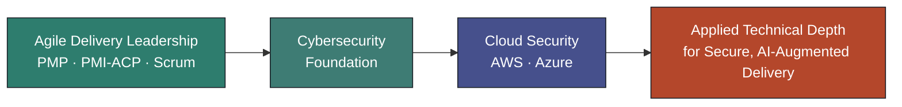

<div align="center">

# Technical Project Management & Business | Cloudpire


<br/>

[](https://linkedin.com/in/your-profile)
[](mailto:your.email@example.com)
[](https://maps.google.com/?q=Your+City)

</div>

<br/>

## 👋 About Me

I’m passionate about **learning technical skills**, contributing to **corporate and startup environments**, and **building businesses that create real value**. My work sits at the intersection of **technical project management, business enablement, cloud security, and practical execution**.

I enjoy learning deeply, working across teams, and turning complexity into clarity. I’m particularly interested in how technology, business, and operations come together to build sustainable growth — whether inside an established organization or a new venture.

I’m also an avid reader and enjoy photography, which keeps me curious, observant, and grounded in both the technical and creative sides of life.

<br/>

## 🧭 Direction: Technical Project Management & Business

I operate at the intersection of **technical project management, business delivery, and cloud security**. My focus is on helping organizations and founders translate technical complexity into practical outcomes — with strong governance, stakeholder alignment, and execution discipline.

I’m especially motivated by work that combines **learning, contribution, and building** — whether that means supporting a growing company, helping a team execute better, or building a business of my own through **Cloudpire**.

Cloudpire is rooted in helping businesses navigate digital and operational change with clarity, structure, and measurable momentum.



<br/>

## 🛠️ Core Competencies

### 🔧 Technical Project Management & Business
- Strategic project delivery for technical initiatives
- Translating business needs into clear execution plans
- Cross-functional stakeholder management and governance
- Supporting growth, transformation, and operational clarity across teams and businesses


<table>
<tr>
<td valign="top" width="50%">

### 🔄 Agile & Delivery Leadership
- Servant leadership & self-managing team design
- Scrum facilitation, coaching & organizational agility
- Stakeholder translation (technical ↔ executive)
- Predictable delivery in complex, regulated environments

</td>
<td valign="top" width="50%">

### ☁️ Cloud & Cybersecurity
- Cloud architecture and security concepts (AWS · Azure)
- Cybersecurity fundamentals and operational risk awareness
- Identity, governance, and Zero Trust principles
- Security-first planning for technical delivery and business change

</td>
</tr>
<tr>
<td valign="top" width="50%">

### 🤖 AI & Modern Delivery
- Identifying practical AI opportunities in delivery workflows
- Improving productivity without losing team ownership
- Supporting modern operational models through tools and process design

</td>
<td valign="top" width="50%">

### 👥 Contribution & Business Enablement
- Contributing to corporate and startup environments with practical value
- Team enablement and operational clarity
- Business process improvement and stakeholder alignment
- Building systems that support learning, delivery, and sustainable growth

</td>
</tr>
</table>

<br/>

## 🏅 Certifications

**Held**


**Current Focus**


<sub>*I continue to deepen my cloud and cybersecurity expertise while applying those skills in real delivery environments.*</sub>

<br/>

## 📌 The Standard Stuff

```yaml
🔭 I'm currently working on:   Deepening my technical foundation while building
                                Cloudpire and supporting business-focused delivery work
🌱 I'm currently learning:     Cloud architecture, cloud security, and how to
                                turn technical knowledge into real business value
👯 I'm looking to collaborate on: Business-building opportunities, startup support,
                                technical project delivery, and cloud/cybersecurity initiatives
🤔 I'm looking for help with:  Real-world cloud security scenarios, business strategy,
                                and practical growth opportunities for modern teams
💬 Ask me about:               Technical project management, business enablement,
                                cloud security, learning strategies, or building with intent
📫 How to reach me:            your.email@example.com · linkedin.com/in/your-profile
😄 Pronouns:                   [your-pronouns]
⚡ Fun fact:                    I’m an avid reader and love photography.
```

<br/>

## 📊 GitHub Activity

<div align="center">


</div>

<br/>

## 🤝 Let's Connect

Always glad to talk technical project management, cloud enablement, business building, and practical digital transformation — especially with founders, teams, and organizations that value learning, execution, and momentum.

<div align="center">

[](https://linkedin.com/in/your-profile)
[](mailto:your.email@example.com)
[](https://maps.google.com/?q=Your+City)

<br/><br/>

<sub>💡 *"A self-managing team isn't one that needs less leadership — it's one where leadership has done its job well enough to become invisible."*</sub>

</div>