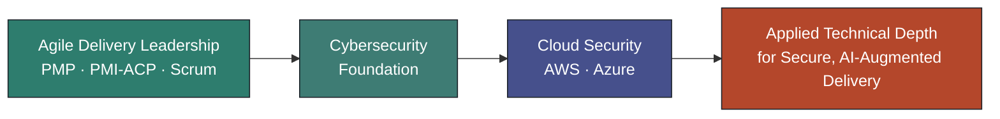

<div align="center">

# Agile Delivery Leader | Cloud & Cybersecurity


<br/>

[](https://linkedin.com/in/YOUR-HANDLE)
[](mailto:YOUR-EMAIL)
[](https://maps.google.com/?q=Your+City)

</div>

<br/>

## 👋 About Me

I'm an **Agile Project Manager and Scrum Master**, **PMP®** and **PMI-ACP®** certified, focused on one thing above all: **building high-performance, self-managing teams.** I lead with Agile values — transparency, inspection, adaptation — applied to delivery that is **secure by design, people-centered in practice, and increasingly AI-augmented.**

I don't see "Agile," "security," and "AI" as three separate conversations. A high-performing team today needs all three working together — psychological safety and self-management *and* a security-first mindset *and* fluency with the AI tools reshaping how the work itself gets done.

<br/>

## 🧭 Direction: Cloud & Cybersecurity

My delivery leadership sits on a **Cybersecurity foundation (BSc)**, and I'm deliberately deepening that into genuine technical range — not to leave Agile leadership behind, but to lead technical and security-driven delivery with real credibility on both sides of the table.



<br/>

## 🛠️ Core Competencies

<table>
<tr>
<td valign="top" width="50%">

### 🔄 Agile & Delivery Leadership
- Servant leadership & self-managing team design
- Scrum facilitation, coaching & organizational agility
- Stakeholder translation (technical ↔ executive)
- Predictable delivery in complex, regulated environments

</td>
<td valign="top" width="50%">

### 🔐 Cloud & Cybersecurity (Growing)
- Cybersecurity fundamentals (BSc)
- Cloud architecture & security concepts (AWS · Azure)
- Identity & Zero Trust principles
- Security-first thinking applied to Agile delivery

</td>
</tr>
<tr>
<td valign="top" width="50%">

### 🤖 AI-Augmented Delivery
- Integrating AI tooling into Agile workflows
- Evaluating AI-driven productivity gains without losing team ownership
- People-centered adoption of AI-augmented practices

</td>
<td valign="top" width="50%">

### 👥 People-Centered Practice
- Psychological safety & trust-building
- Conflict facilitation & team health
- Coaching individuals through change
- Building teams that self-manage, not just self-report

</td>
</tr>
</table>

<br/>

## 🏅 Certifications

**Held**


**On the Roadmap**


<sub>*Roadmap credentials reflect an active, structured study plan — not yet certified. I believe in being precise about that distinction.*</sub>

<br/>

## 📌 The Standard Stuff

```yaml
🔭 I'm currently working on:   Deepening cloud architecture skills (AWS/Azure) while
                                leading Agile delivery in my day-to-day role
🌱 I'm currently learning:     Cloud security fundamentals, Zero Trust principles,
                                and how to apply AI tooling inside Agile workflows
                                without eroding team ownership
👯 I'm looking to collaborate on: Secure-by-design Agile practices, AI-augmented
                                delivery patterns, and cloud security fundamentals
🤔 I'm looking for help with:  Real-world cloud security scenarios and mentorship
                                from practitioners further along the cybersecurity path
💬 Ask me about:               Agile coaching, Scrum facilitation, building
                                self-managing teams, or PMP/PMI-ACP prep
📫 How to reach me:            [YOUR-EMAIL] · linkedin.com/in/[YOUR-HANDLE]
😄 Pronouns:                   [YOUR-PRONOUNS]
⚡ Fun fact:                    [YOUR-FUN-FACT]
```

<br/>

## 📊 GitHub Activity

<div align="center">


</div>

<br/>

## 🤝 Let's Connect

Always glad to talk Agile leadership, high-performing team design, or the intersection of security and delivery — especially with anyone navigating a similar path from Agile leadership into deeper technical territory.

<div align="center">

[](https://linkedin.com/in/YOUR-HANDLE)
[](mailto:YOUR-EMAIL)
[](https://maps.google.com/?q=Your+City)

<br/><br/>

<sub>💡 *"A self-managing team isn't one that needs less leadership — it's one where leadership has done its job well enough to become invisible."*</sub>

</div>